# 注册账号
## 访问[aws][1]注册账号
- 要准备的材料visa信用卡 or master信用卡

> 注册过程中需要绑定信用卡，会扣$1(预授权)。但需要注意的是，在没有用超的情况下，是免费的，作为SS服务器，只能是流量超额会导致（15GB/月）

- 开通国际长途业务的手机号

> 注册过程中，需要填写手机号，会有国际长途（手机号默认开通）打进来，告诉你验证码。

### 选择AWS免费套餐
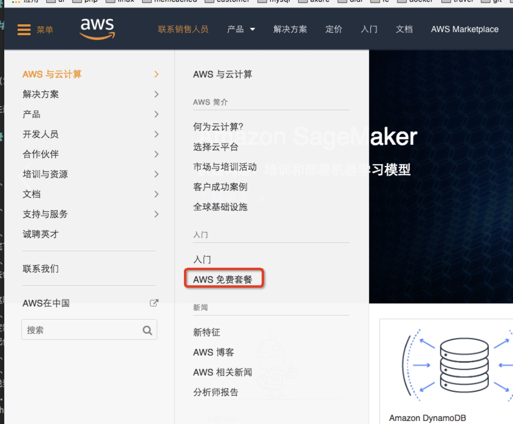
### 创建账号
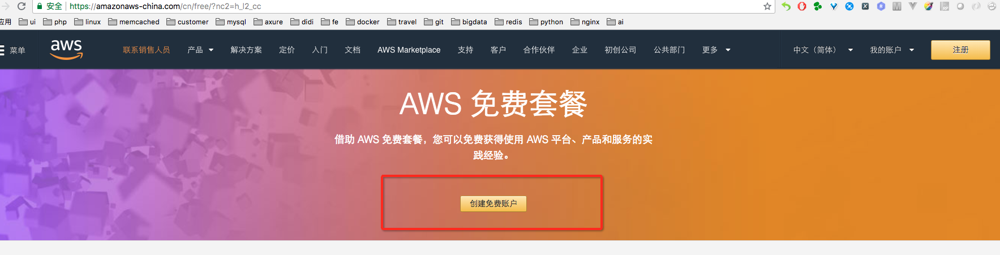
### 输入邮箱、密码、账号名
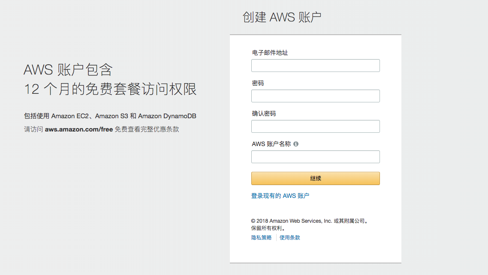
### 输入手机号、住址
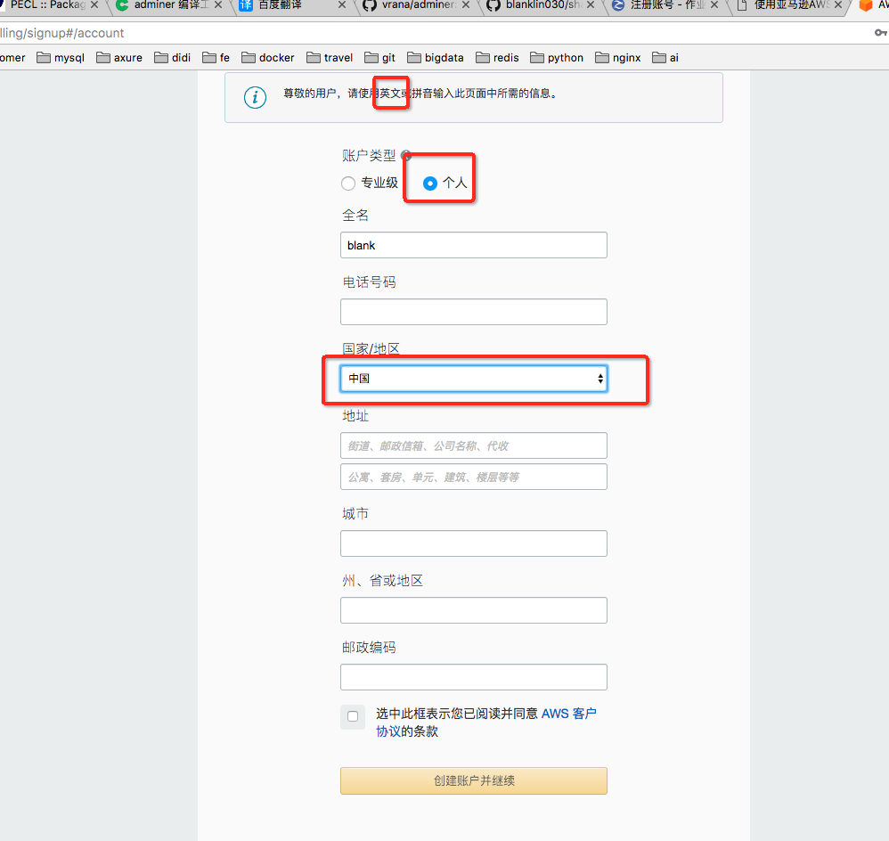
### 绑定信用卡
> 会从信用卡扣1$，可去淘宝购买信用卡信息
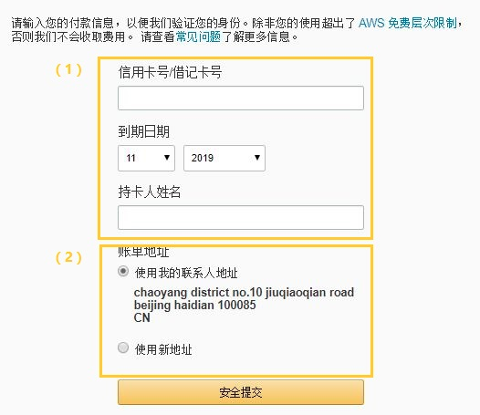
### aws打验证电话
> 输入可接入国际长途电话的手机号，以便aws打验证电话
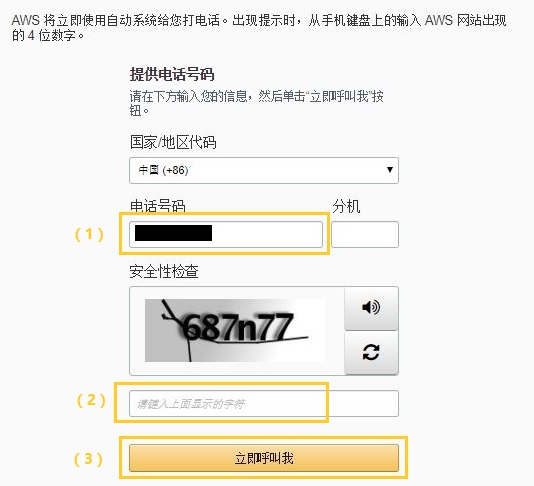
> 屏幕上自动显示4位数字PIN码，按照语音提示输入这4位验证码
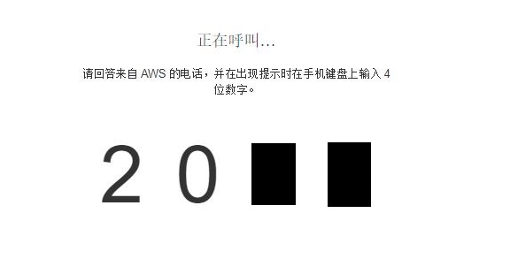
### 选择免费方案
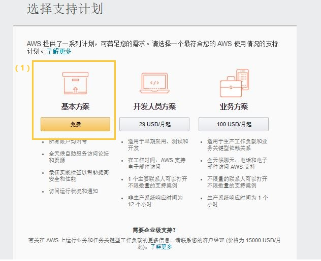
### 注册成功
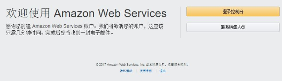
# 创建AWS实例
> 用刚才注册好的账号登录AWS控制台，点击EC2（云中的虚拟服务器）
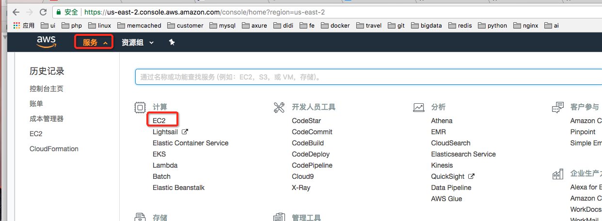
## 定制服务器类型
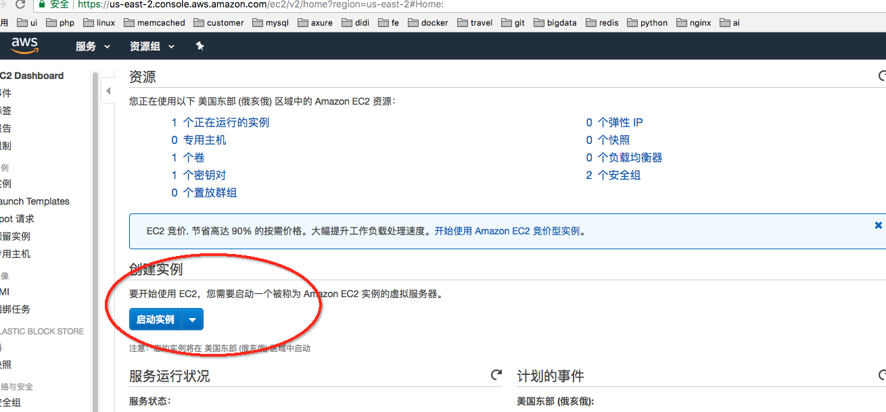
## 勾选仅免费套餐
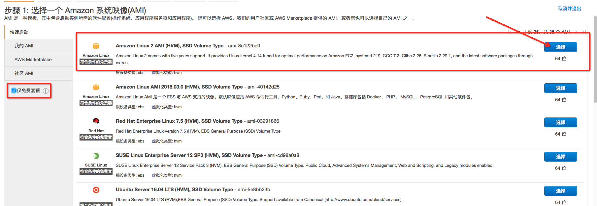
## 选择唯一的免费项目
> 底下有绿框描述
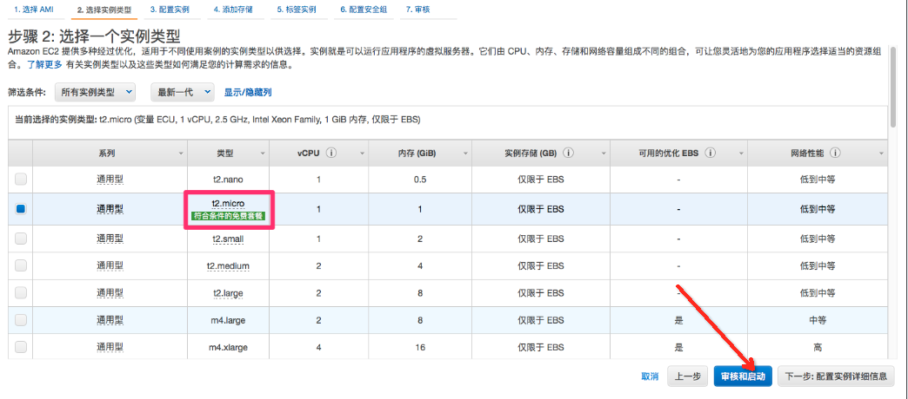
## 直接选蓝色按钮【审核和启动】
去创建密钥对
> 这时候会提示生成密钥对，这个很重要，一定要保存好，没有这个密钥对是无法远程登录管理你的服务器的，所以一定要保存好。
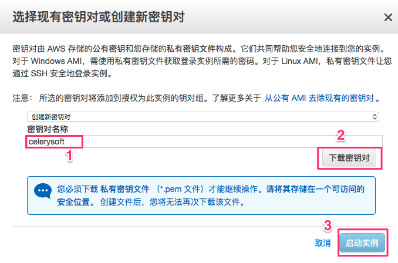
## 连接到服务器
> 定制完成后等几分钟，一般是在给你的服务器进行开发，等初始化完成后，就可以进行远程连接了，记住这里显示的公有IP地址，就是你的shadowsocks的服务器IP
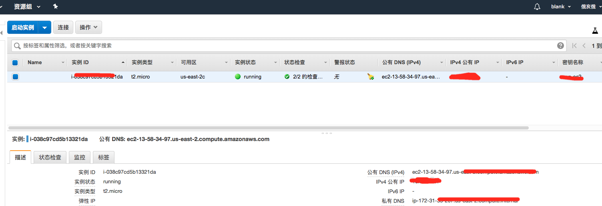
## 点击连接会弹出对话框
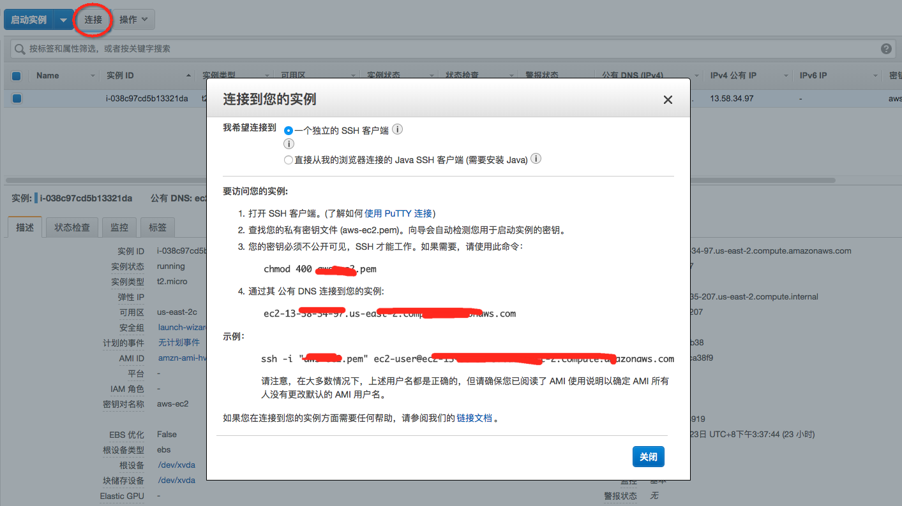
## 以下过程以mac os系统为例
> 找到你在【创建密钥对】创建的pem文件地址

### 使用chmod命令确保私有密钥不是公开可见的
chmod 400 /Users/Celery/.ssh/celerysoft.pem
### 通过ssh命令连接到服务器
```
sh -i /Users/Celery/.ssh/celerysoft.pem ec2-user@ec2-11-111-11-111.ap-northeast-1.compute.amazonaws.com
```
> 注意9.1和9.2都是在【第8步】弹出的对话框里会提示你如何连接的,登录成功后提示你保存密钥，你就都按yes就可以了

## 安装shadowsocks服务
### 切换为root用户
> sudo su -

### 安装python
> yum install -y python-setuptools

### 安装pip
> easy_install pip

### 安装shadowsocks
> pip install shadowsocks

### 配置shadowsocks.json
> vi /etc/shadowsocks.json

```
{
 "server":"0.0.0.0",
 "server_port":端口,
 "local_address":"127.0.0.1",
 "local_port":1080,
 "password":"密码",
 "timeout":300,
 "method":"aes-256-cfb",
 "fast_open":false,
 "workers": 1
}
```
> 修改上面的中文：“端口” 和 “密码”，这两个将在之后使用手机连接ss时要使用到，请务必记下来
> > 配置文件说明	
 
* server	服务端监听地址(IPv4或IPv6)
* server_port	服务端端口，一般为443
* local_address	本地监听地址，缺省为127.0.0.1
* local_port	本地监听端口，一般为1080
* password	用以加密的密匙
* timeout	超时时间（秒）
* method	加密方法，默认为aes-256-cfb，更多请查阅Encryption
* fast_open	是否启用TCP-Fast-Open，true或者false
* workers	worker数量，如果不理解含义请不要改（这个只在Unix和Linux下有用）

### 开启ss服务
```
ssserver -c /etc/shadowsocks.json -d start
```
> 如果找不到ssserver,使用which ssserver找到ssserver绝对路径，类似下面：/usr/local/bin/ssserver -c /etc/shadowsocks.json -d start

### 加到开机启动项
```
    vi /etc/rc.local
    sudo ssserver -c /etc/shadowsocks/ss.json -d start
```


### 控制台里面给服务添加安全组
点安全组，如下图
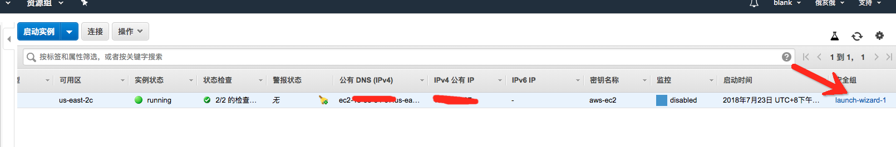
点入站=》编辑，如下图
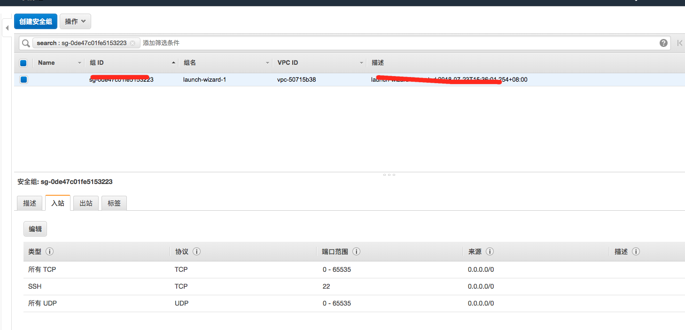

## 下载客户端
当然你也可以到GitHub下载最新的客户端：

+ [Windows客户端下载地址][2]
+ [macOS客户端下载地址][3]
+ [Linux客户端下载地址][4]

### 配置shadowsocks客户端
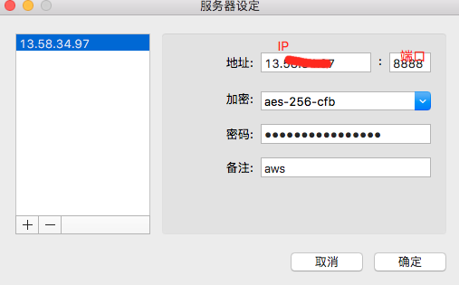
### 配置Chrome的SwitchySharp扩展
> 选择私人VPN，开启网络之旅。如果要上国内网站，可选择Direct Connection，这样不走代理会更快。
> https://raw.githubusercontent.com/breakwa11/gfw_whitelist/master/whiteiplist.pac
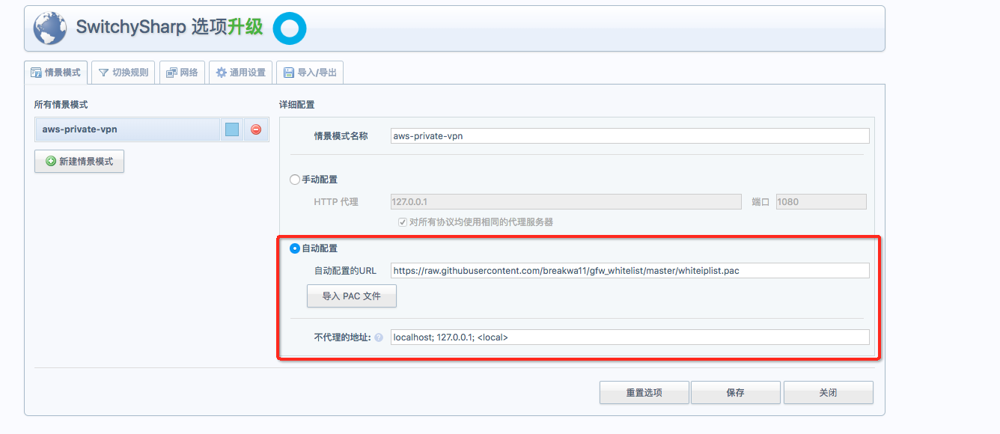
## 踩坑提示

+ AWS免费的服务器只有一台12个月，切勿开启多台，因为那都是要钱的，不要问我怎么知道的！学费教的有点多
+ 一台服务器每个月的流量是15G
+ 在选择服务器地区的时候最好选择加州的，因为我有一次选择俄岗啥的，第二天就死活登不上去服务（我使用俄亥俄州没问题）
+ 注意只有12个月的免费期，超过期限就开始收费了，aws会有邮件通知，但我没注意看，于是8月被收取了10$，心痛
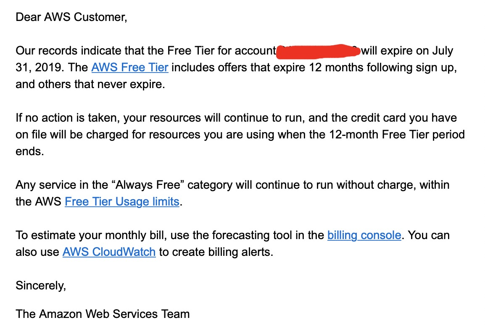


  [1]: https://aws.amazon.com/cn/
  [2]: https://github.com/shadowsocks/shadowsocks-windows/releases
  [3]: https://github.com/shadowsocks/shadowsocks-iOS/releases
  [4]: https://github.com/shadowsocks/shadowsocks-qt5/releases
